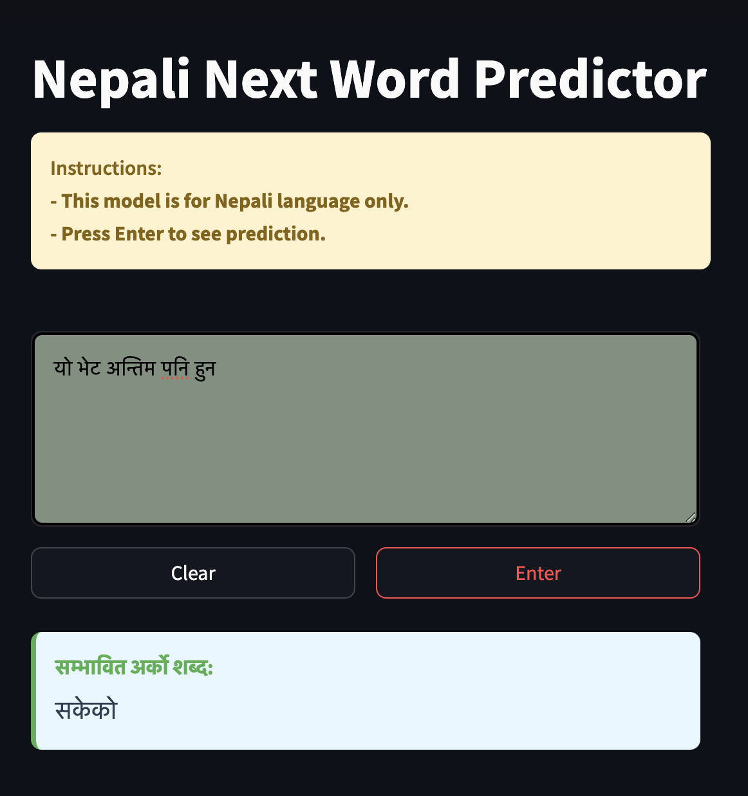

# Nepali Next Word Prediction using GRU RNN

This project implements a next word prediction model for Nepali text using a Gated Recurrent Unit (GRU) Recurrent Neural Network architecture. The model is trained on a Nepali text dataset and is deployed as a Streamlit web application.



## Features

- Real-time next word prediction for Nepali text
- Simple and intuitive user interface
- Interactive text input with instant predictions
- Clear text functionality
- Trained on a large corpus of Nepali text

## Architecture: GRU RNN

### What is GRU?
GRU (Gated Recurrent Unit) is a type of RNN architecture that helps solve the vanishing gradient problem in traditional RNNs. It uses two gates:
- **Update Gate**: Decides how much of the past information to keep
- **Reset Gate**: Determines how much past information to forget

### Why GRU for Next Word Prediction?
1. **Memory Efficiency**: Simpler than LSTM with fewer parameters
2. **Context Understanding**: Capable of learning long-term dependencies
3. **Fast Training**: Generally trains faster than LSTM
4. **Performance**: Often performs similarly to LSTM but with better efficiency

### Model Architecture
```python
model = Sequential([
    Embedding(total_words, 100, input_length=max_sequence_len-1),
    GRU(150, return_sequences=True),
    Dropout(0.2),
    GRU(100),
    Dense(total_words, activation="softmax")
])
```

## Technical Stack

- Python 3.12+
- TensorFlow/Keras for the GRU model
- Streamlit for the web interface
- NumPy for numerical computations

## Project Structure
```
Next_word_prediction/
│
├── prediction.ipynb      # Jupyter notebook with model training
├── app.py               # Streamlit web application
├── requirements.txt     # Project dependencies
├── next_word_lstm.h5    # Trained model
├── tokenizer.pickle     # Saved tokenizer
└── README.md           # Project documentation
```

## Setup and Installation

1. Clone the repository:
```bash
git clone <repository-url>
cd Next_word_prediction
```

2. Create and activate virtual environment:
```bash
python -m venv venv
source venv/bin/activate  # On Windows: venv\Scripts\activate
```

3. Install dependencies:
```bash
pip install -r requirements.txt
```

## Running the Project

### Training the Model
To train the model from scratch:
1. Open `prediction.ipynb` in Jupyter Notebook:
```bash
jupyter notebook prediction.ipynb
```
2. Run all cells sequentially
3. The trained model will be saved as `next_word_lstm.h5`

### Running the Streamlit App
To run the web interface:
```bash
streamlit run app.py
```
This will open the application in your default web browser.

## Using the Web Interface

1. Type Nepali text in the input area
2. Press "Enter" button to get prediction
3. Use "Clear" button to start over
4. The model will predict the most likely next word

## Model Performance

- Training Accuracy: ~69%
- Validation Accuracy: ~11%
- The model performs well on common Nepali phrases and sentences

## Dependencies
- TensorFlow 2.x
- Streamlit
- NumPy
- Pandas
- Keras
- Pickle

## Limitations
- Works only with Nepali text
- Predictions are based on training data patterns
- May not handle very complex or technical language well

## Future Improvements
- Increase training data size
- Implement bi-directional GRU
- Add temperature parameter for prediction diversity
- Improve UI/UX of web interface

## License
This project is licensed under the MIT License - see the LICENSE file for details.
